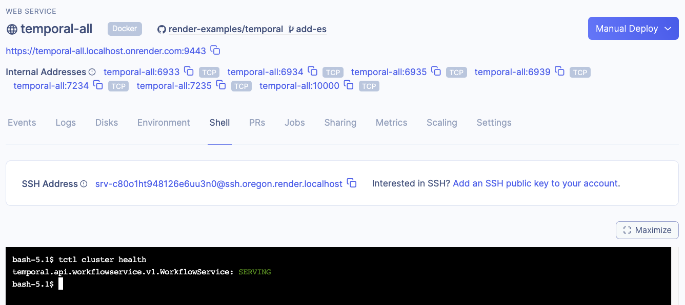
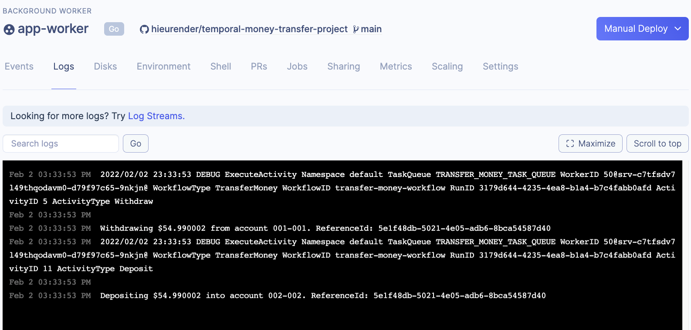

# Simple Temporal Setup on Render

This is a template for running a simple version of Temporal on Render. This is not recommended for production beyond small use cases, as all 4 Temporal internal services (Frontend, Matching, History, and Worker) are being run out of one server, but the benefit is that setup is a lot simpler. For a more production-ready setup, see the [render-examples/temporal repo](https://github.com/render-examples/temporal).

The deployment also includes an example Go app that interacts with the cluster. Fork this repo and click the button below to try it out!

[](https://render.com/deploy)

> ⚠️ Note: this blueprint spins up 4 server instances and 2 Postgres instances, all on Render's "Starter" plan, which (as of Feb 2022) will cost $42 if left running for a whole month. Remember to tear down your resources when just kicking the tires.

This repo defines a [Render Blueprint](https://render.com/docs/blueprint-spec) with the following components:
- Temporal cluster:
    - Two Postgres databases, `temporal-db` and `temporal-db-visibility`.
    - A `temporal` server that runs all Temporal services.
    - `temporal-ui` provides the Temporal web UI.
- Example app (from [Render's sample Temporal app](https://github.com/render-examples/sample-temporal-app)):
    - `app-workflow-trigger` runs a simple HTTP server with two routes:
        - `/` for health checking.
        - `/trigger-workflow` for kicking off the `TransferMoney` workflow.
    - `app-worker` executes any triggered workflows.

# Deploy Steps

1. Click the "Deploy to Render" button.
2. In your Render dashboard, click on the service `app-workflow-trigger`, and copy its URL. Let's say it's `https://app-workflow-trigger.onrender.com/`.
3. To verify that your Temporal cluster is running correctly, you can use Temporal's CLI tool `tctl`. Gain shell access to the `temporal` service:
    - Using [SSH](https://render.com/docs/ssh).
    - Using the web shell:
      

   Some commands to run (with expected, non-exact output):
    ```bash
    $ tctl cluster health
    temporal.api.workflowservice.v1.WorkflowService: SERVING
    $ tctl admin membership list_gossip  # list all temporal services.
    [
      {
        "role": "frontend",
        "member_count": 1,
        "members": [
          {
            "identity": "0.0.0.0:7233"
          }
        ]
      },
      {
        "role": "history",
        "member_count": 1,
        "members": [
          {
            "identity": "0.0.0.0:7234"
          }
        ]
      },
      {
        "role": "matching",
        "member_count": 1,
        "members": [
          {
            "identity": "0.0.0.0:7235"
          }
        ]
      },
      {
        "role": "worker",
        "member_count": 1,
        "members": [
          {
            "identity": "0.0.0.0:7239"
          }
        ]
      }
    ]
    ```
4. Go to `https://app-workflow-trigger.onrender.com/`. If everything is well, you will see "OK!".
5. Now trigger the example workflow by visiting `https://app-workflow-trigger.onrender.com/trigger-workflow`. It should print
    ```
    Transfer of $54.990002 from account 001-001 to account 002-002 is processing. ReferenceID: 5e1f48db-5021-4e05-adb6-8bca54587d40

    WorkflowID: transfer-money-workflow RunID: 3179d644-4235-4ea8-b1a4-b7c4fabb0afd
    ```
6. `app-worker` will immediately pick up and run this workflow. You can verify by clicking on the service, and going to the "Logs" tab:
   
7. To check that the workflow has been run successfully, click on the `temporal-ui` service, and go to its URL. Under the `default` namespace, you should find your workflow's run with the status "Completed".
